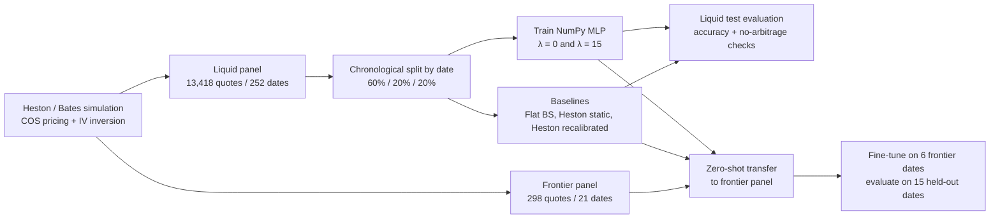

# Deep Learning for Option Pricing and Implied Volatility Surfaces

**A no-arbitrage neural network approach, benchmarked against Black–Scholes and Heston, with a frontier-market (NGX-style) transferability test**

[](https://doi.org/10.21203/rs.3.rs-11048383/v1)
[-orange)](https://doi.org/10.21203/rs.3.rs-11048383/v1)
[](https://creativecommons.org/licenses/by/4.0/)

Companion code and notebook for the preprint by **Tosin Bello** and **Adeniyi Adefioye** (University of Ibadan, Nigeria), posted on Research Square on 16 September 2026:
<https://doi.org/10.21203/rs.3.rs-11048383/v1>

---

## Table of contents

1. [Overview](#overview)
2. [Headline findings](#headline-findings)
3. [Pipeline at a glance](#pipeline-at-a-glance)
4. [Repository structure](#repository-structure)
5. [Method summary](#method-summary)
6. [Getting started](#getting-started)
7. [Full results](#full-results)
8. [Reproducibility notes](#reproducibility-notes)
9. [Adapting the code to real market data](#adapting-the-code-to-real-market-data)
10. [Limitations](#limitations)
11. [Citation](#citation)
12. [Authors and contact](#authors-and-contact)
13. [Acknowledgements](#acknowledgements)
14. [License](#license)

---

## Overview

Neural networks are widely proposed as flexible alternatives to Black–Scholes and stochastic-volatility models for fitting implied-volatility (IV) surfaces, but almost all evidence comes from liquid, developed-market options. This project investigates two questions:

1. **In-domain:** does adding soft *no-arbitrage* penalties (calendar-spread and butterfly) to a network's loss improve IV-surface accuracy and reduce arbitrage violations in the market it was trained on?
2. **Out-of-domain:** does a network trained on a liquid, developed-market-style surface transfer to a thinly traded, high-interest-rate, jump-prone market inspired by the **Nigerian Exchange (NGX)**, and how much local data is needed to repair it if not?

The whole study lives in a single, top-to-bottom-runnable notebook. The neural network is implemented **from scratch in NumPy** (no TensorFlow or PyTorch), so that every gradient in the composite loss, including the finite-difference arbitrage penalties, is derived by hand and verified against numerical gradients.

> ### Important note on the data
> Genuine option data were not available for this study. OptionMetrics-grade chains are proprietary (WRDS), and the NGX does not currently list exchange-traded options (only index and single-stock *futures*). The notebook therefore uses a fully disclosed **semi-synthetic protocol**: option panels are generated from Heston / Bates stochastic-volatility processes with parameters anchored to literature-reported ranges and to real macroeconomic inputs (the stylised U.S. short-rate cycle and the Central Bank of Nigeria's Monetary Policy Rate of 26.5%, retained in July 2026).
>
> Results should be read as evidence about how these methods behave under a **stylised severe distribution shift**, not as a forecast of performance on real NGX options.

---

## Headline findings

| # | Finding | Evidence |
|---|---------|----------|
| 1 | A moderate no-arbitrage penalty (λ = 15) improves in-domain accuracy | Liquid test IV RMSE **0.0314** (penalised) vs **0.0407** (unpenalised), a 23% relative reduction |
| 2 | The penalty reduces, but does not eliminate, butterfly violations | Validation sweep on a held-out fine grid: 12.5% (λ = 0) → 4.5% (λ = 15); see [Table 4](#table-4--no-arbitrage-violation-frequency-dense-test-period-grid) for the test grid |
| 3 | A per-date recalibrated Heston model is the strongest benchmark on both markets | IV RMSE **0.0199** (liquid test), **0.0398** (frontier) |
| 4 | Zero-shot transfer to the frontier market fails for both networks | IV RMSE **0.0981** (unpenalised) and **0.3043** (penalised), versus **0.0779** for a naive flat-volatility Black–Scholes baseline |
| 5 | The penalty that helps in-domain can hurt out-of-domain | The penalised network is the *better* network on the liquid test set but the *worse* one on the frontier panel |
| 6 | A tiny amount of target-market data recovers most of the gap | Fine-tuning on 86 quotes / 6 dates → held-out frontier IV RMSE ≈ **0.086–0.087** for both networks |
| 7 | Inference is orders of magnitude cheaper than calibration | ≈ 0.0005 ms per quote (batched forward pass) vs ≈ 2.5–5 s per date for a full Heston calibration |

**Take-away:** arbitrage-aware regularisation improves in-domain accuracy but is not a substitute for domain adaptation. In a thin, data-scarce market, a frequently recalibrated parametric model remains the safer default unless a small target-domain sample is available for fine-tuning.

---

## Pipeline at a glance



---

## Repository structure

```
.
├── Deep_Learning_Option_Pricing_Analysis.ipynb   # the entire study, run top to bottom
├── tables/                                       # cached Heston calibration results (see "Getting started")
│   ├── heston_params_train.csv
│   ├── heston_params_test.csv
│   ├── heston_params_frontier.csv
│   ├── heston_iv_test.csv
│   └── heston_iv_frontier.csv
├── requirements.txt
└── README.md
```

### Notebook map and where it appears in the manuscript

| Notebook section | What it does | Manuscript |
|---|---|---|
| Setup | Imports, global seed (`20260913`) | – |
| **1. Pricing engines** | Black–Scholes price/vega, robust IV inversion (Newton with Brent fallback), Heston/Bates COS pricer, validation against the Black–Scholes limit | §3.2 |
| **2. Data protocol** | Simulates the liquid (Heston) and frontier (Bates) option panels | §3.1, Appendix A |
| **3. Feature engineering and time split** | Features, target, standardisation, strict chronological 60/20/20 split | §3.4, §3.6 |
| **4. Classical baselines** | Flat Black–Scholes, static Heston, per-date recalibrated Heston | §3.3 |
| **5. NumPy neural network** | `MLP` class, `ArbitragePenalizedTrainer`, and a numerical gradient check | §3.5 |
| **6. Training and tuning** | Training loop with early stopping, hyperparameter search, penalty-weight sweep, final models | §3.7, §3.8, §4.2 |
| **7. Liquid-market evaluation** | Table 1 (accuracy) and Table 4 (no-arbitrage violation rates) | §4.1, §4.3 |
| **8. Frontier transferability** | Table 5 (zero-shot) and Table 6 (fine-tuning) | §4.4, §4.5 |
| **9. Computational cost** | Table 7 (wall-clock timing) | §4.6 |
| **10. Figure gallery** | Figures 1, 3, 4 and 7 | §4 |
| **11. Summary** | Findings-versus-evidence table | §5 |

<!-- AUTHOR NOTE (delete before publishing): the manuscript also contains Figures 2, 5, 6 and 8, which are not generated in the notebook. Add those cells or adjust the wording above. -->

---

## Method summary

### Pricing engines

* **Black–Scholes–Merton:** closed-form price and vega, plus an implied-volatility inversion using Newton–Raphson safeguarded by a bracketed Brent fallback (search bounds 10⁻⁴ to 5).
* **Heston (1993) / Bates (1996):** European options priced with the **COS method** (Fang & Oosterlee, 2008; N = 256 cosine terms, truncation L = 10) from the Heston/Bates characteristic function, with an optional compound-Poisson log-normal jump component so one engine generates both the smooth liquid surface and the jumpy frontier surface.
* **Validation:** with vol-of-vol → 0 the COS price collapses onto the closed-form Black–Scholes price (maximum absolute difference ≈ 1.7 × 10⁻⁷ in the notebook run; the cell asserts `< 1e-5`).

### Data protocol

Both panels use a full-truncation Euler simulation of the underlying path, then price European calls with the COS method, add multiplicative noise, and invert to Black–Scholes IV.

| | Liquid panel | Frontier panel |
|---|---|---|
| Process | Heston | Bates (Heston + log-normal jumps) |
| κ (mean reversion) | 2.0 | 3.2 |
| θ (long-run variance) | 0.045 | 0.095 |
| Vol-of-vol | 0.38 | 0.60 |
| ρ | −0.72 | −0.50 |
| Initial variance | 0.032 | 0.09 |
| Jumps (intensity / mean / vol) | none | 0.55 per year / −9% / 14% |
| Initial spot | 2,900 | 105 |
| Risk-free rate | Stylised U.S. path, near zero in 2020–21 rising to ≈ 4.5% | Constant **26.5%** (CBN MPR, July 2026) |
| Snapshots | 252 weekly dates (≈ 5 years, 2019–2024-style dynamics) | 21 dates, one every 15 trading days |
| Moneyness grid (K/S) | 11 points, 0.80–1.20 | 5 points, 0.85–1.15 |
| Maturities | 1m, 3m, 6m, 1y, 2y | 1m, 3m, 6m |
| Pricing noise | 1% | 3.5% |
| Usable quotes | **13,418** | **298** |
| Role | Train / validation / test | Zero-shot test and fine-tuning **only** (never in training) |

### Features, target and split

* **Features (4):** log-moneyness `ln(K/S)`, time to maturity `T`, trailing 21-day annualised realised volatility, and the risk-free rate. All are standardised with **training-set statistics only**.
* **Target:** total implied variance `w = σ² T`, the natural variable for the static no-arbitrage conditions.
* **Split:** strictly chronological by date, with no shuffling across boundaries (following the look-ahead-bias critique of Ruf & Wang, 2020).

| Subset | Dates | Quotes |
|---|---|---|
| Train | 151 | 8,015 |
| Validation | 50 | 2,661 |
| Test | 51 | 2,742 |

### Baselines

* **Flat Black–Scholes:** each date's own at-the-money IV applied to that date's entire smile (arbitrage-free by construction, but ignores the smile).
* **Heston, recalibrated per date:** five parameters (κ, θ, vol-of-vol, ρ, v₀) fitted on every evaluation date by bounded trust-region-reflective least squares, warm-started from the previous date.
* **Heston, static:** parameters frozen from the last training-period calibration and carried forward unchanged, isolating the cost of *not* recalibrating.

### Network and loss

A tanh feed-forward network with a linear output layer, Glorot/Xavier-uniform initialisation and an Adam optimiser, all written in NumPy. The loss combines data fit with two soft no-arbitrage penalties on total variance `w(k, T)`, following the soft-constraint principle of Ackerer, Tagasovska & Vatter (2020):

$$
\mathcal{L} \;=\; \frac{1}{N}\sum_{i}\big(\hat w_i - w_i\big)^2 \;+\; \lambda_{\text{cal}}\;\overline{\min\!\big(\partial_T \hat w,\,0\big)^2} \;+\; \lambda_{\text{bfly}}\;\overline{\min\!\big(\partial_{kk} \hat w,\,0\big)^2}
$$

where the overbars denote means over a penalty grid, and derivatives are finite differences:

* **Calendar-spread:** total variance must be non-decreasing in maturity, `∂w/∂T ≥ 0`, using a forward difference with `h_T = 1/365` year.
* **Butterfly (convexity):** `∂²w/∂k² ≥ 0`, using a centred second difference with `h_k = 0.01` in log-moneyness.

The butterfly term is a deliberately simplified finite-difference proxy for the full Durrleman condition, not a complete analytical no-arbitrage guarantee.

**Implementation details worth knowing**

* Penalties are evaluated on a grid of 20 log-moneyness points × 8 maturities spanning the training range, with realised volatility and the risk-free rate held at their training medians.
* The finite-difference step sizes are rescaled into the network's *standardised* input space. An earlier version applied raw-unit steps to standardised coordinates, which silently made the penalty ineffective. This bug was found and fixed during development (documented in the notebook).
* **Gradient check:** hand-derived backpropagation, including through the finite-difference penalty terms, is verified against central differences on a small test network. Maximum relative error: **1.44 × 10⁻⁸** (the cell asserts `< 1e-5`).

### Training and model selection

| Setting | Value |
|---|---|
| Architecture (selected on validation IV RMSE) | 4 → 32 → 32 → 1, tanh hidden units |
| Optimiser | Adam (lr = 5 × 10⁻³, β₁ = 0.9, β₂ = 0.999) |
| L2 weight decay | 1 × 10⁻⁴ |
| Batch size / epochs | 512 / 500 |
| Early stopping | Validation total-variance RMSE, checked every 10 epochs; best-epoch weights restored |
| Penalty weight (λ<sub>cal</sub> = λ<sub>bfly</sub>) | Swept over {0, 15, 60, 120}; **λ = 15** selected |
| Compared models | λ = 0 (no penalty) and λ = 15 (arbitrage-penalised) |

### Evaluation protocol

* **Accuracy:** IV and option-price RMSE / MAE on the held-out test dates. Price errors are reconstructed by pricing with Black–Scholes at the model's predicted volatility.
* **No-arbitrage violations:** share of points on a dense 40-point log-moneyness grid × all test maturities where the finite-difference calendar or butterfly condition is violated by more than a `1e-6` tolerance.
* **Transferability:** every model applied to the frontier panel **zero-shot** (no retraining for the networks). Heston is additionally recalibrated directly on frontier data as the minimal adaptation a parametric model allows.
* **Fine-tuning:** each pretrained network is fine-tuned (lr = 2 × 10⁻⁴, 150 epochs) on the earliest 6 frontier dates (86 quotes) and scored on the remaining 15 dates (212 quotes).

---

## Getting started

### Requirements

* Python 3 (the notebook was executed on Python 3.13)
* `numpy`, `pandas`, `scipy`, `matplotlib`, and `jupyter`

`requirements.txt`:

```text
numpy
pandas
scipy
matplotlib
jupyter
```

No GPU is needed. The whole study runs on a single CPU core; training both final networks plus the hyperparameter and penalty sweeps takes well under a minute.

### Install and run

```bash
git clone https://github.com/<your-username>/<repo-name>.git
cd <repo-name>

python -m venv .venv
source .venv/bin/activate          # Windows: .venv\Scripts\activate
pip install -r requirements.txt

jupyter notebook Deep_Learning_Option_Pricing_Analysis.ipynb
```

Then choose **Kernel → Restart & Run All**.

### Cached Heston calibrations (`tables/`)

Per-date Heston calibration is the slowest step (roughly 2.5–5 s per date, about 110 dates in total, so a few minutes on one CPU core). By default the notebook **loads pre-computed calibration results** from CSV files rather than recomputing them. Two things to do before the first run:

1. **Point the notebook at your local `tables/` folder.** In the cell that begins `# --- Heston calibration: load pre-computed results ...`, change

   ```python
   TAB = "/home/claude/project/tables"
   ```

   to

   ```python
   TAB = "tables"
   ```

2. **Make sure the five CSV files exist in `tables/`** (they ship with the repository). If you would rather regenerate them yourself, run the cell below once, immediately after the *Feature engineering and time split* cell and before the cache-loading cell:

   ```python
   import os
   os.makedirs("tables", exist_ok=True)

   # Training: every 4th date (a representative subsample); test and frontier: every date
   train_dates_sub = np.sort(train_df["day"].unique())[::4]
   params_train, _, _ = calibrate_heston_panel(train_df, dates=train_dates_sub)
   params_test, modeliv_test, _ = calibrate_heston_panel(test_df)
   params_fro, modeliv_fro, _ = calibrate_heston_panel(frontier_df)

   params_train.to_csv("tables/heston_params_train.csv", index=False)
   params_test.to_csv("tables/heston_params_test.csv", index=False)
   params_fro.to_csv("tables/heston_params_frontier.csv", index=False)
   modeliv_test.rename("heston_iv_recal").to_csv("tables/heston_iv_test.csv")
   modeliv_fro.rename("heston_iv_recal").to_csv("tables/heston_iv_frontier.csv")
   ```

Everything else (both option panels, all network training, all evaluation) is regenerated from scratch on every run.

---

## Full results

All numbers below are the notebook's executed outputs. Timings depend on hardware.

### Table 1 — Liquid-market test-period accuracy

51 held-out dates, 2,742 quotes; lower is better. Price errors are in index-level currency units (the simulated spot starts at 2,900).

| Model | N | IV RMSE | IV MAE | Price RMSE | Price MAE |
|---|---:|---:|---:|---:|---:|
| Flat Black–Scholes (ATM) | 2,742 | 0.0471 | 0.0325 | 68.92 | 42.73 |
| Heston — static (train-period fit) | 2,687 | 0.0676 | 0.0510 | 70.14 | 51.25 |
| **Heston — recalibrated per date** | 2,742 | **0.0199** | **0.0088** | **10.93** | **7.52** |
| NN — no arbitrage penalty | 2,742 | 0.0407 | 0.0267 | 33.34 | 24.68 |
| NN — with arbitrage penalty | 2,742 | 0.0314 | 0.0229 | 36.05 | 25.85 |

Notes:

* Recalibrated Heston is fitted directly to each test date's own cross-section, an information advantage the networks (trained once, then frozen) do not have. The fairest like-for-like comparison for the frozen networks is the *static* Heston row.
* Static Heston has fewer scored quotes (2,687) because some model-implied IVs could not be inverted.
* The static Heston parameters have a Feller ratio (2κθ / vol-of-vol²) of ≈ 0.17, well below one, a known signature of calibration instability.
* The penalised network has the lower IV RMSE but a slightly higher price RMSE than the unpenalised network (36.05 vs 33.34).

### Table 2 — Hyperparameter search

Validation set, 150-epoch runs, no arbitrage penalty. The bold row was selected.

| Hidden layers | Learning rate | L2 | Validation IV RMSE |
|---|---:|---:|---:|
| (16, 16) | 0.005 | 1e-5 | 0.0663 |
| (32, 32) | 0.005 | 1e-5 | 0.0794 |
| **(32, 32)** | **0.005** | **1e-4** | **0.0366** |
| (64, 32) | 0.005 | 1e-5 | 0.0465 |
| (64, 64, 32) | 0.003 | 1e-5 | 0.0565 |

### Table 3 — Penalty-weight sensitivity

λ<sub>cal</sub> = λ<sub>bfly</sub> = λ. Butterfly-violation rate measured on a held-out fine grid.

| λ | Validation IV RMSE | Butterfly violation rate |
|---:|---:|---:|
| 0 | 0.0441 | 12.5% |
| **15** | **0.0297** | **4.5%** |
| 60 | 0.0584 | 3.0% |
| 120 | 0.0996 | 0.5% |

The relationship with accuracy is non-monotonic: a moderate penalty acts as a useful regulariser, while stronger penalties keep reducing violations at a growing cost in fit.

### Table 4 — No-arbitrage violation frequency (dense test-period grid)

| Model | Calendar-spread violations | Butterfly violations |
|---|---:|---:|
| Flat Black–Scholes (ATM) | 0.0% | 0.0% |
| Heston — static | 20.0% | 24.0% |
| NN — no arbitrage penalty | 0.0% | 5.0% |
| NN — with arbitrage penalty | 0.0% | 4.5% |

<!-- AUTHOR NOTE (delete before publishing): the manuscript (Section 4.3, Table 4) and the notebook's own Section 11 summary cell report NN butterfly violations of 9.0% (no penalty) vs 5.0% (penalty). The executed notebook output above is 5.0% vs 4.5%. Reconcile the notebook, the manuscript, and this table before release. -->

Flat Black–Scholes is arbitrage-free by construction. Static Heston shows the highest measured violation rates because its poorly identified, near-Feller-boundary frozen parameters misbehave on the fine grid, not because of a flaw in the Heston model itself.

### Table 5 — Frontier-market zero-shot transferability

21 dates, 298 quotes. No model was retrained on frontier data in this table, except the "recalibrated" Heston row, which is fitted on the frontier data by design.

| Model | N | IV RMSE | IV MAE | Price RMSE | Price MAE |
|---|---:|---:|---:|---:|---:|
| Flat Black–Scholes (ATM) | 298 | 0.0779 | 0.0531 | 0.68 | 0.48 |
| Heston — static (liquid-market fit, no recalibration) | 282 | 0.0736 | 0.0545 | 1.05 | 0.67 |
| **Heston — recalibrated on frontier data** | 298 | **0.0398** | **0.0262** | **0.37** | **0.26** |
| NN — no arbitrage penalty (zero-shot) | 298 | 0.0981 | 0.0816 | 1.21 | 0.92 |
| NN — with arbitrage penalty (zero-shot) | 298 | 0.3043 | 0.2963 | 2.81 | 2.11 |

The penalised network is roughly 7.7 times worse than recalibrated Heston. The likely mechanism is that the penalty acts as a domain-specific inductive bias, tying the learned curvature and extrapolation behaviour to the liquid market's moneyness range, volatility level and rate regime (< 5% in training versus 26.5% on the frontier panel).

### Table 6 — Effect of minimal fine-tuning

Fine-tuned on 86 quotes / 6 dates; evaluated on 212 quotes / 15 held-out frontier dates.

| Model | Zero-shot IV RMSE | Fine-tuned IV RMSE | Relative improvement |
|---|---:|---:|---:|
| NN — no penalty | 0.0952 | 0.0861 | ≈ 10% |
| NN — arbitrage penalty | 0.3017 | 0.0867 | ≈ 71% |

Fine-tuning closes most of the gap and erases the difference between the two regularisation regimes, but neither network reaches recalibrated Heston (0.0398).

### Table 7 — Computational cost (single CPU core)

| Model | Cost | Note |
|---|---|---|
| Flat Black–Scholes | ≈ 0.09 ms per quote | Closed-form price (dominated by Python-level overhead) |
| Heston full calibration | ≈ 2.5–5 s per date | About 40–55 quotes per date, bounded least squares |
| Neural network (trained) | ≈ 0.0005 ms per quote | Batched forward pass only |

### Figures produced by the notebook

| Figure | Content |
|---|---|
| Figure 1 | IV smiles on a representative held-out test date at two maturities: target vs flat BS, recalibrated Heston, and both networks |
| Figure 3 | Validation-loss curves during training, with and without the penalty |
| Figure 4 | IV RMSE across all five models, liquid test vs frontier zero-shot |
| Figure 7 | Frontier IV RMSE before and after fine-tuning, with Heston and flat-BS reference lines |

The notebook also plots the simulated underlying paths for both markets as a sanity check.

---

## Reproducibility notes

* **Seeds:** global seed `20260913` (`np.random.seed`). The liquid simulator uses `default_rng(20260913)`; the frontier simulator uses `default_rng(20260914)` (seed + 1). Network initialisation is seeded (`seed=1` for the quick hyperparameter search, `seed=2` for the penalty sweep and the final models). Panel generation and training are therefore deterministic given the same library versions.
* **Library versions:** numerical libraries can shift last-digit results across versions, and the least-squares Heston calibration is sensitive to that, which is one reason the calibration results are cached in `tables/`.
* **Timings** (Tables 2 and 7) vary with hardware and load; treat them as orders of magnitude.
* **Correctness checks built into the notebook:** the COS-vs-Black–Scholes limit test (`assert < 1e-5`) and the numerical gradient check (`assert < 1e-5`). If either fails, do not trust downstream results.

---

## Adapting the code to real market data

The pipeline only needs a pandas `DataFrame` (one row per option quote) with these columns:

| Column | Meaning |
|---|---|
| `day` | Integer date index (chronological; used for the time-based split and per-date calibration) |
| `S` | Underlying price on that date |
| `K` | Strike |
| `T` | Time to maturity in years |
| `r` | Risk-free rate (continuously compounded) |
| `rv` | Trailing 21-day annualised realised volatility |
| `moneyness` | `K / S` |
| `log_moneyness` | `ln(K / S)` |
| `price` | Observed option price |
| `iv` | Black–Scholes implied volatility of that price |

Replace the `build_liquid_panel()` / `build_frontier_panel()` calls with your own loaders that return this schema, and call `reset_index(drop=True)` on each frame (the baselines index by position). Current assumptions to keep in mind: **European calls, no dividend yield (q = 0)**, and a single fixed set of four features.

---

## Limitations

1. **Semi-synthetic data.** Both panels are simulated. Real microstructure, jump clustering and NGX-specific liquidity and quoting conventions almost certainly differ from any single Heston or Bates specification. The liquid panel is itself generated by a Heston model, so the Heston benchmark is well specified there.
2. **Calibration instability.** Per-date Heston calibration showed the well-known day-to-day parameter instability; some calibrated parameters sit at the imposed optimisation bounds (for example κ ≤ 6 and vol-of-vol ≤ 1), indicating local rather than global optima. A multi-start scheme could partly address this.
3. **Simplified arbitrage penalty.** The butterfly term is a finite-difference proxy for the Durrleman condition, and it constrains the surface only at the sampled penalty-grid points. Violations between grid points, or far outside the grid, are not directly discouraged.
4. **Asymmetric comparison.** Recalibrated Heston uses same-date information, whereas the networks are trained once and frozen.
5. **Modest search and compute.** A single CPU core limited the architecture search to five shallow configurations and the Heston training-period calibration to a subsample of dates.
6. **Pricing, not hedging.** The study evaluates IV-surface and price accuracy only. Delta and vega hedging performance is left to future work.

**Future work:** evaluate on genuine data if NGX or comparable exchanges launch listed options; add hedging-effectiveness comparisons; explore domain-adaptation methods richer than simple fine-tuning that keep the penalised network's in-domain advantage without its transfer fragility.

---

## Citation

If you use this code or build on the study, please cite the preprint:

```bibtex
@misc{bello2026deep,
  title     = {Deep Learning for Option Pricing and Implied Volatility Surfaces:
               A No-Arbitrage Neural Network Approach with a Frontier-Market
               Transferability Test},
  author    = {Bello, Tosin and Adefioye, Adeniyi},
  year      = {2026},
  publisher = {Research Square},
  doi       = {10.21203/rs.3.rs-11048383/v1},
  url       = {https://doi.org/10.21203/rs.3.rs-11048383/v1},
  note      = {Preprint, not peer reviewed}
}
```

### Key methodological references

* Heston, S. L. (1993). A closed-form solution for options with stochastic volatility. *Review of Financial Studies*, 6(2), 327–343.
* Fang, F., & Oosterlee, C. W. (2008). A novel pricing method for European options based on Fourier-cosine series expansions. *SIAM Journal on Scientific Computing*, 31(2), 826–848.
* Ackerer, D., Tagasovska, N., & Vatter, T. (2020). Deep smoothing of the implied volatility surface. *NeurIPS 33*, 11552–11563.
* Fengler, M. R. (2009). Arbitrage-free smoothing of the implied volatility surface. *Quantitative Finance*, 9(4), 417–428.
* Ruf, J., & Wang, W. (2020). Neural networks for option pricing and hedging: a literature review. *Journal of Computational Finance*, 24(1), 1–46.
* Gatheral, J. (2006). *The Volatility Surface: A Practitioner's Guide*. Wiley.
* Albrecher, H., Mayer, P., Schoutens, W., & Tistaert, J. (2007). The little Heston trap. *Wilmott Magazine*, 2007(1), 83–92.

The full reference list is in the manuscript.

---

## Authors and contact

* **Tosin Bello** (corresponding author), University of Ibadan, Nigeria. [ORCID 0009-0001-6225-5602](https://orcid.org/0009-0001-6225-5602) · tbello505@stu.ui.edu.ng
* **Adeniyi Adefioye**, University of Ibadan, Nigeria

Questions, bug reports and suggestions are welcome; please open an issue on this repository.

---

## Acknowledgements

As disclosed in the manuscript, Claude (Anthropic) was used to assist with literature search and verification, implementation of the pricing, simulation and neural-network code, execution of the computational analysis, and drafting of the manuscript text. The author directed the research design, verified the cited literature against primary sources, independently checked the analysis (including the numerical gradient check), reviewed and edited all AI-assisted output, and takes full responsibility for the content.

The frontier-market calibration uses the Central Bank of Nigeria's Monetary Policy Rate of 26.5% (retained at the July 2026 MPC meeting; source: Nairametrics, 21 July 2026), and the description of the NGX derivatives market follows Nigerian Exchange Group (2026).

---

## License

The manuscript is licensed under [CC BY 4.0](https://creativecommons.org/licenses/by/4.0/).
